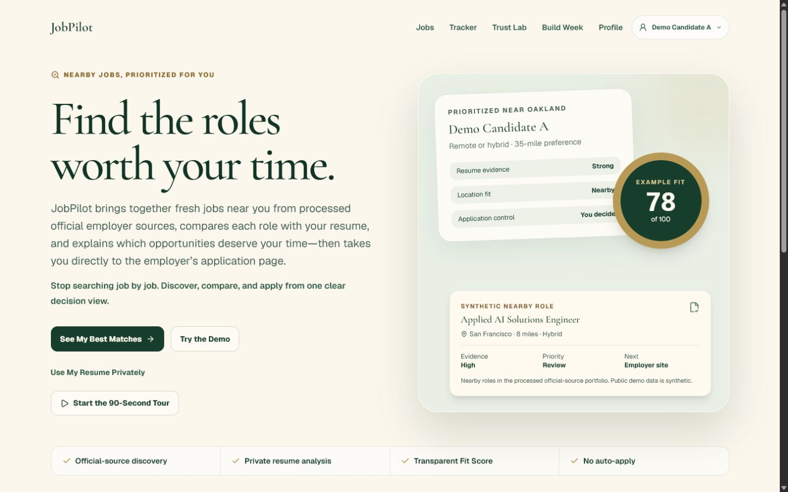

# JobPilot — Find the Roles Worth Your Time

## JP-BW13 authentic impact candidate

**Authentic Study: Five participants completed a moderated directional comparison of a traditional posting and JobPilot.** Median task time was 39 seconds with the traditional posting and 18 seconds with JobPilot; factual accuracy was 75% versus 100%. Average confidence was 3.8 versus 6.0 out of 7, and clarity was 3.6 versus 6.2 out of 7.

All participants completed the traditional condition first and JobPilot second. Different roles prevented same-role carryover, but practice or order effects may contribute to the observed difference. The result is directional usability evidence, not causal proof or hiring-outcome evidence. See the aggregate-only [public report](build-week/bw13/authentic-study-report.md), [methodology](build-week/bw13/study-methodology.md), and [frozen aggregate](build-week/bw13/authentic-study-aggregate.json).

## JP-BW12 owner-polish foundation

Primary UI now resolves machine identifiers through one display-language boundary. Raw IDs remain only in explicit technical disclosures and machine artifacts. Application Strategy is 209 words by default and 380 words with every disclosure expanded; it uses translated evidence names with collapsed provenance and limitations.

The Study auto-saves locally and exposes phase-specific CSV and JSON downloads above the fold. Preview, Pilot, and browser-test Final exports are excluded from participant analysis. Factual accuracy covers four role facts; Apply / Review Further / Skip is reported separately as decision alignment.

Final competition video: `build-week/video/jobpilot-vercel-elevenlabs-final-rc4-burned-captions.mp4` (173.133333 seconds; H.264 video; AAC English narration; burned captions plus an embedded English subtitle track; SHA-256 `7b9c572379f0c131395aca8abfc739ac05b1d124393a9c8e8c6b881667aa1c32`). It is the sole approved competition video and matches the public demo at <https://job-pilot-build-week.vercel.app>.

Job search fatigue comes from repeating the same discovery work, opening postings one by one, manually comparing a resume, and still not knowing which application deserves the next hour. JobPilot connects the decision loop:

`DISCOVER → PRIORITIZE → UNDERSTAND → APPLY → TRACK`

The public judge flow needs no login, account, database, OpenAI key, Ollama installation, browser location permission, or real resume. Its candidate, roles, employer destinations, captures, and video are synthetic for privacy and reproducibility.

```bash
npm install
npm run build
npm run start
```

Open `http://localhost:3000`, choose **See My Best Matches**, or start the optional **90-Second Tour**.

JP-BW11R separates the public product landing from the app home. `/` explains the job-seeker value; `/demo/shortlist` is the distinct **For You** dashboard. The final-product RC adds restrained premium motion, reduced-motion behavior, intentional loading/empty/success/error states, visual decision summaries, grouped evidence, an exact collapsed Technical Ledger, and the isolated Decision Utility Study Protocol V2.



## Why JobPilot is different

Traditional job search often fragments discovery, resume comparison, employer handoff, and tracking across separate surfaces. JobPilot joins them without attacking named competitors, claiming complete-market coverage, or automating the user's application decision.

| Step | Traditional fragmented search | JobPilot |
| --- | --- | --- |
| Discover | Repeat searches across feeds and tabs | Bring nearby and Remote roles from a processed source portfolio into one view |
| Prioritize | Re-read postings and build an informal ranking | Publish deterministic visible factors and show three roles worth attention |
| Understand | Compare requirements and a resume manually | Separate required/preferred evidence, experience, gaps, blockers, and score proof |
| Apply | Find and re-check the employer destination | Open the fictional employer destination only after an explicit user action |
| Track | Record progress in another tool | Keep browser-local planning state without auto-applying |

## Today's 3 Roles Worth Your Time

`/demo/shortlist` places **Why these three?** above the role cards with three visible reasons: Best evidence fit, Works with your preferences, and Recent enough to act on. **No hidden shortlist score.** Exact ordering remains available under **See the full ranking method** and applies one lexicographic policy:

1. numeric-score eligibility;
2. blocker state;
3. Fit Score;
4. Evidence Quality;
5. physical distance or Remote;
6. posting freshness;
7. stable job ID.

No weights are combined and no hidden shortlist score exists. Strongest matches, biggest gaps, and exact evidence remain on Job Detail instead of crowding the default shortlist. Distance, work mode, and freshness never modify technical Fit Score.

## Public-safe production coverage

The public demo remains synthetic, but `/about/coverage` renders one immutable aggregate snapshot from the larger original JobPilot acquisition system. At `2026-07-18T17:41:08.379Z` the read-only snapshot recorded:

- 145,978 unique active catalog jobs;
- 13,164 unique California jobs;
- 6,426 San Francisco Bay Area memberships;
- 1,108 Los Angeles County memberships under the exact `LOS_ANGELES_COUNTY` contract;
- 473 active official-source endpoints, 446 with a latest complete snapshot;
- 145,978 original posting records;
- 2,727 URLs with positive reachability evidence;
- 2,727 verified apply destinations;
- last successful refresh at `2026-07-18T10:09:52.791Z`.

Recorded, reachable, and verified are deliberately different destination claims. Counts describe the processed catalog and source portfolio, not complete market coverage. The earlier JP-41 certificate counted a bounded 2,808-record private-shadow generation; the frozen Build Week snapshot counts the later active `Job` catalog after subsequent acquisition and refresh generations. They are different counting populations. Catalog and California totals count unique `Job.id` values; regional memberships can overlap and are never summed into that total. Duplicate counting is zero.

```bash
npm run bw9:freeze -- --original-repo <path-to-read-only-original-JobPilot-repository>
```

The immutable snapshot semantic hash is `68f2195f1e4a6d4dce155eb2dfcd9e209643d412e30d949ca65bd2bee6ae8414`. See [the public timeline](build-week/bw9/coverage-public-timeline.md), [full methodology](build-week/bw9/coverage-methodology.md), and [query contract](build-week/bw9/coverage-query-contract.json).

## Hybrid AI with an exact score boundary

1. **Gemma 4 12B** is the primary semantic model for ambiguous role extraction, capability grouping, candidate profiling, evidence matching, equivalence, summaries, and uncertainty. Private resume analysis stays on loopback Ollama.
2. **Deterministic code** owns every micro-point, class cap, transfer, month-level experience union, practical constraint, Evidence Quality value, priority, and Score Receipt.
3. **`gpt-5.6-sol` prepared reviews through Codex** add bounded application strategy, challenge analysis, ambiguity review, and pairwise comparison from frozen synthetic evidence.

All four prepared artifacts expose their Codex generation surface, verifiable `gpt-5.6-sol` provenance, frozen input hash, output hash, file hash, valid evidence IDs, zero API requests, and `model-generated final score: No`. Only final structured outputs are stored; hidden reasoning is not published.

The submitted runtime made **0 OpenAI API requests** and incurred **$0 API cost**.

## Independent Score Receipt verification

Open `/demo/verify-receipt`, upload or paste bounded JSON, or use the bundled receipt. The verifier reproduces canonical serialization, SHA-256, the exact 100,000,000 micro-point allocation, class caps, transfers, rounding, practical separation, evidence IDs, and frozen source inputs.

```bash
npm run generate:demo-receipt
npm run verify:receipt -- build-week/bw7/receipts/northstar-demo-receipt.json
```

See [SCORE_RECEIPT_VERIFIER.md](SCORE_RECEIPT_VERIFIER.md).

## Decision Utility Study

`/study/decision-utility` is intentionally absent from primary product navigation. Protocol `jobpilot-decision-utility.v2` uses two different fictional roles: Analytics Operations Engineer and Data Enablement Engineer. Group 1 reviews A Raw then B JobPilot; Group 2 reviews B Raw then A JobPilot. A primer and two comprehension checks precede one-question-per-screen conditions. PREVIEW and PILOT are always excluded; only authentic, validated FINAL sessions can count. Responses stay browser-local and there is no network submission path.

Status: **COMPLETE_MINIMUM**. Actual participant count: **5**. Five authentic Final files produced ten human rows with zero rejected or fabricated rows. The combined data remains local and untracked; only aggregate values and its SHA-256 are public. Synthetic tooling validation is never presented as human evidence. See [the protocol](build-week/study/protocol.md), [consent](build-week/study/consent.md), [methodology](build-week/bw13/study-methodology.md), and [aggregate report](build-week/bw13/authentic-study-report.md).

```bash
npm run study:validate -- build-week/study/inbox
npm run study:combine -- build-week/study/inbox
npm run study:analyze -- build-week/study/validated/combined.csv
```

The participant inbox rejects incomplete pairs, duplicate conditions, consent mismatches, identifying columns, and dry-run/tooling rows before combination. Participant-level inbox and validated files are ignored by Git.

## Private Resume Mode

The local edition accepts PDF, DOCX, and UTF-8 TXT up to 10 MB, parses in memory, requires editable extraction review, stores only the confirmed structured profile in browser-local storage, and sends confirmed evidence only to loopback `gemma4:12b`. Raw bytes and complete raw text are absent from public artifacts and prepared reviews.

See [PRIVATE_RESUME_MODE.md](PRIVATE_RESUME_MODE.md).

## Validation

```bash
npm test
npm run typecheck
npm run lint
npm run build
npm run test:css-pipeline
npm run validate:providers
npm run validate:local-gemma
npm audit --audit-level=low
```

The JP-BW11R certificate covers 28 required states and a 40-check route–viewport matrix at 1440×900, 1024×768, 390×844, and 320×700. It records zero horizontal overflow, console errors, undersized primary controls, duplicate summary capabilities, default point decimals, fabricated participants, API calls, and application submissions under `build-week/bw11r/`.

## Key routes

- Product: `/`, `/demo/shortlist`, `/demo/jobs`, `/demo/jobs/[id]`, `/demo/compare`, `/demo/tracker`
- Proof: `/demo/trust`, `/demo/verify-receipt`, `/about/coverage`, `/about/build-week`
- Isolated research: `/study/decision-utility`
- Private local profile: `/profile`, `/profile/resume`, `/profile/preferences`, `/profile/private-mode`
- Health and verification: `/api/health`, `/api/provider-status`, `/api/verify-receipt`

## Judge and release evidence

- [Judge Guide](JUDGE_GUIDE.md)
- [Product UX](PRODUCT_UX.md), [nearby discovery](NEARBY_DISCOVERY.md), and [direct employer flow](DIRECT_EMPLOYER_FLOW.md)
- [Architecture](ARCHITECTURE.md), [privacy](PRIVACY.md), and [zero-API GPT-5.6](ZERO_API_GPT56.md)
- `build-week/bw8/` — production aggregates, provenance, validation, captures, and release evidence
- `build-week/study/` — frozen decision-utility kit, status `READY_NOT_RUN`
- `build-week/video/jobpilot-vercel-elevenlabs-final-rc4-burned-captions.mp4` — sole owner-approved competition video, with permanently visible burned captions
- `build-week/video/jobpilot-vercel-elevenlabs-final-rc4-metadata.json` — public-safe final video metadata and Vercel provenance
- `build-week/video/jobpilot-vercel-elevenlabs-final-rc4-frame-audit.json` — public-safe frame and right-edge review

## Development-phase boundary

This remains a development release candidate. A non-final public owner-review environment may be available, but JobPilot has not made the video Public, submitted Devpost, obtained final owner approval, or created a final release tag. Code and original documentation are MIT licensed.

Public owner-review environment: <https://job-pilot-build-week.vercel.app>. It uses synthetic demo data, cached prepared analyses, no OpenAI key, no production database, no Ollama connection, and no public resume upload. Its public version record distinguishes approved product commit `173bf67` from deployment wrapper commit `0b3aaba`.

After the final production build, the exact local owner-approval surface starts only through:

```bash
npm run preview:certified -- --port 3210
```

The command rejects a dirty worktree or UI-source drift, validates the current commit and BUILD_ID, checks runtime CSS status/bytes/hash, computed-style and geometry sentinels, all owner routes, health, and build/server parity, then keeps the certified preview running.

## Codex `/feedback` status

The representative Build Week task is `Finalize JobPilot product UX`. Its primary Codex `/feedback` Session ID is `019f7382-0ef9-7d10-bf26-d6e5615924dd`; it covers the concentrated JP-BW6–JP-BW10 product, proof, prepared-review, QA, and release sequence, and the four prepared GPT-5.6 artifacts bind to that task.
