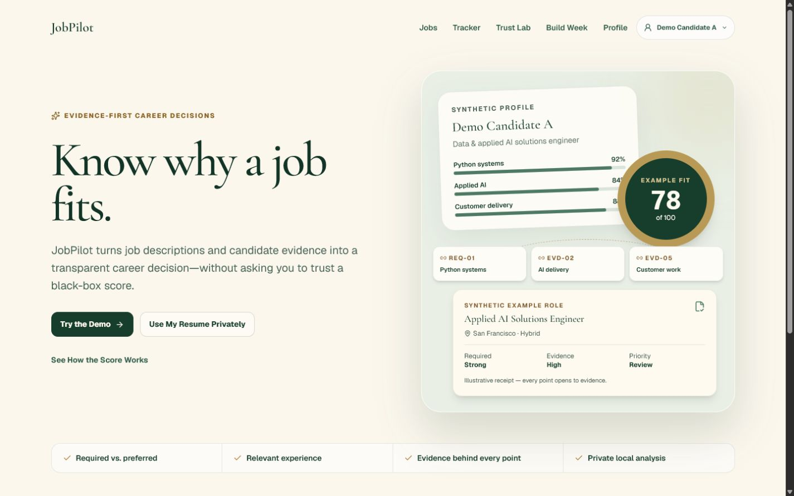
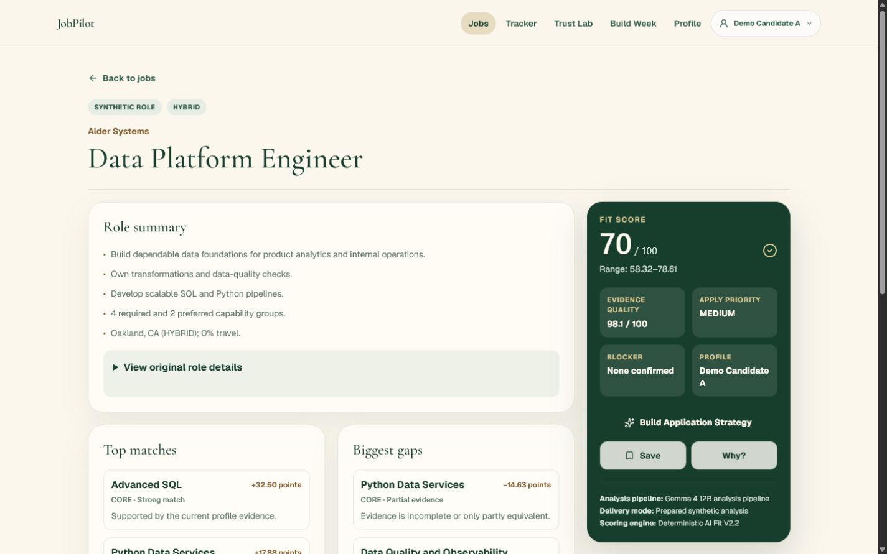

# JobPilot — Evidence-First AI Job Search

> Know why a job fits.

JobPilot turns job descriptions and candidate evidence into a transparent career decision—without asking you to trust a black-box score. It separates required and preferred qualifications, maps every scored capability to evidence, keeps practical constraints separate, and reconciles each eligible Fit Score to exactly 100 visible points. A Fit Score is an evidence-based ranking score, not a hiring probability.

## Try the Demo

The public judge path needs no login, account, database, Ollama installation, or OpenAI key:

```bash
npm install
npm run build
npm run start
```

Open `http://localhost:3000`, choose **Try the Demo**, and use the six fictional roles with Demo Candidate A. Prepared Gemma analyses and prepared strategy output keep this path reliable. Nothing is submitted to an employer.

The decision flow is:

`Landing → Jobs → Role Overview → Evidence or Experience → Score Proof → Receipt → Strategy → Tracker → Trust Lab`

## Use My Resume Privately

The local edition accepts PDF, DOCX, and UTF-8 TXT resumes up to 10 MB. It parses the selected file in memory, presents an editable extraction review, saves only the confirmed structured profile in browser-local storage, and sends that confirmed evidence only to loopback Ollama. Raw bytes and complete raw text are not persisted, logged, included in reports, or included in Score Receipts.

```dotenv
LOCAL_PRIVATE_MODE="true"
OLLAMA_ENABLED="true"
OLLAMA_BASE_URL="http://127.0.0.1:11434"
OLLAMA_MODEL="gemma4:12b"
```

Install Ollama, make `gemma4:12b` available locally, start JobPilot, and open `/profile/resume`. A built-in synthetic test resume exercises the real parser safely. PDF files require selectable text; OCR is intentionally unavailable. Public Judge Mode leaves `LOCAL_PRIVATE_MODE=false`, rejects upload bodies before parsing, and points users to the local setup guide.

## Product modes

- **Public Judge Mode:** synthetic candidate, six synthetic roles, prepared Gemma analyses, deterministic scoring, prepared no-key strategy, and a browser-local tracker.
- **Local Private Mode:** in-memory PDF/DOCX/TXT parsing, editable profile review, work preferences, loopback `gemma4:12b` matching, deterministic scoring, and a local Score Receipt.
- **Optional GPT-5.6 heavy mode:** explicit application strategy, critique, difficult ambiguity, and strategy comparison. It receives only validated requirements, selected minimal evidence, IDs, constraints, and the deterministic receipt. It never calculates or changes the score.

## Hybrid AI responsibility boundary

1. **Gemma 4 12B** is the primary semantic model for ambiguous requirements, capability grouping, evidence matching, equivalence, summaries, and uncertainty.
2. **Deterministic code** owns cleaning, date unioning, point allocation, class caps, practical constraints, Evidence Quality, Apply Priority, and the Score Receipt.
3. **GPT-5.6 Terra** is optional heavy reasoning. It is never used for routine scoring and never receives a complete raw resume in Build Week mode.
4. **Prepared output** keeps public judging reproducible and is never labeled live or fresh.

Provider provenance is displayed as three separate fields:

- Public: `Gemma 4 12B analysis pipeline` / `Prepared synthetic analysis` / `Deterministic AI Fit V2.2`
- Local: `Gemma 4 12B — Live Local` / `Private local analysis` / `Deterministic AI Fit V2.2`
- Optional heavy: `GPT-5.6 Terra — Live` only after a real configured call is certified

## Professional decision UX

The JP-BW6 product RC replaces the dense serial audit with four progressive tabs: Overview, Evidence, Experience, and Score Proof. The first desktop viewport shows the role, concise summary, Fit Score, Evidence Quality, Apply Priority, strongest match, biggest gap, and primary action. Exact quotes, formulas, and technical receipt JSON remain one click away.





## Score contract

- CORE begins at 85 points.
- PREFERRED contributes at most 12; preferred experience at most 4.
- NICE_TO_HAVE contributes at most 3 and at most 1 per capability.
- Unused class capacity transfers visibly to CORE.
- Integer micro-point arithmetic and stable largest-remainder allocation reconcile eligible analyses to 100.
- Work mode, location, and travel affect Apply Priority, never technical points.
- UNKNOWN is not a confirmed gap.
- Insufficient evidence never displays a numeric Fit Score.
- Hidden adjustments are always zero.

See [AI_SCORE_METHODOLOGY.md](AI_SCORE_METHODOLOGY.md) and [AI_SCORE_EVALUATION.md](AI_SCORE_EVALUATION.md).

## Validation

```bash
npm test
npm run typecheck
npm run lint
npm run build
npm run validate:providers
npm run validate:local-gemma
```

`validate:local-gemma` never pulls or substitutes a model. Optional GPT-heavy validation requires a server-side key and enablement flag; without them it exits configuration-required and never prints a key.

## Routes

- `/`, `/demo`, `/demo/jobs`, `/demo/jobs/[id]`, `/demo/tracker`, `/demo/trust`
- `/profile`, `/profile/resume`, `/profile/preferences`, `/profile/private-mode`
- `/about/build-week`, `/api/health`, `/api/provider-status`

## Privacy and limitations

The repository contains only original synthetic candidate, job, and resume fixtures. The parser rejects malformed, oversized, mismatched, active-content, binary, and path-like input; removes DOCX external relationships; excludes protected-attribute text; and treats prompt-like resume text as inert data. No production database, employer logo, auto-apply, or application submission is present.

Independent hiring-outcome calibration is not yet available. The public demonstration data is synthetic. Private resume analysis runs only in the local edition. GPT-5.6 features require optional server configuration. JobPilot does not predict employer decisions.

## Repository map

- `src/server/build-week/` — environment validation, providers, deterministic scorer, schemas, and proof tests
- `src/server/private-profile/` — hardened parser and loopback Gemma analysis
- `src/components/demo/` — no-login decision interface
- `src/components/profile/` — browser-local profile review and work preferences
- `build-week/demo-data/` — frozen synthetic product inputs
- `build-week/bw6/` — product UX, privacy, visual, usability, performance, and release evidence
- `build-week/video/` — current and historical recording packages
- `build-week/devpost/` — account-ready submission materials

## License

Code and original documentation are available under the [MIT License](LICENSE). Synthetic fixtures contain no third-party job text, resume, logo, or personal data. New parser dependencies use permissive MIT, BSD-2-Clause, and Apache-2.0 licenses recorded in the JP-BW6 security and license audit.
